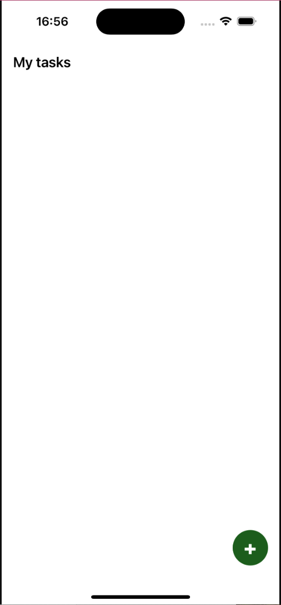
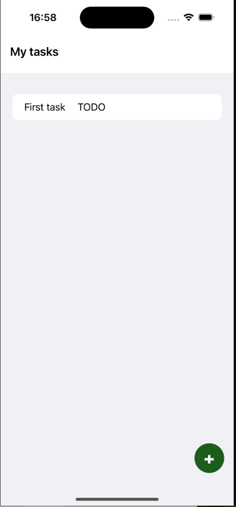
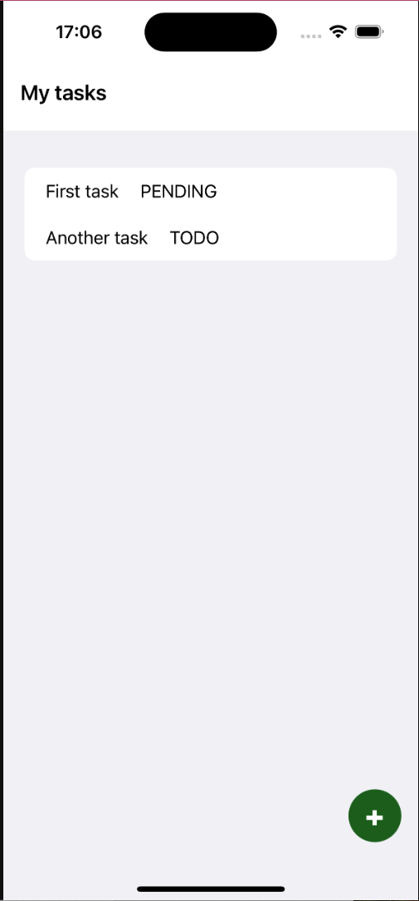
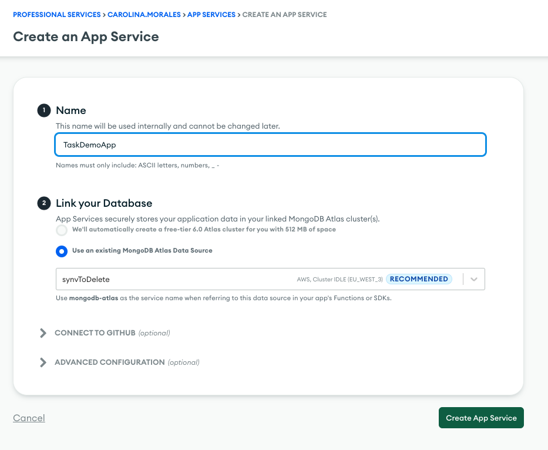
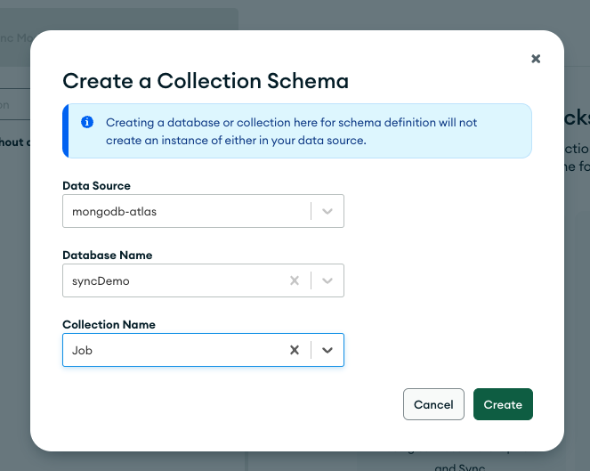
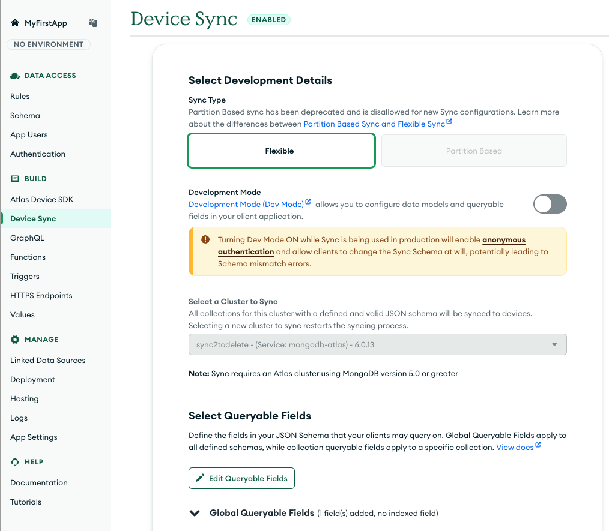
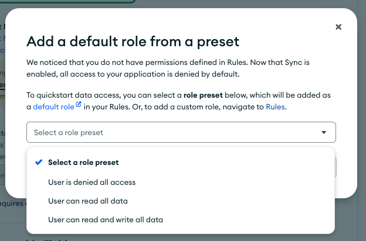

# SyncDemo
Demos for Realm Sync to MongoDB using Swift SDK

# Application functionality
It simulates a simple Task list application. There is a list of Tasks with different status.

## Empty task list view



### Adding a new task


### Task list view



### Changing a task status



## Requirements

* A working IOS simulator (I used the one included in Xcode)
* Atlas App Services CLI: https://www.mongodb.com/try/download/app-services-cli


## Configuration

1. Create a new **Free** Account in MongoDB Atlas: https://www.mongodb.com/cloud

2. Once cluster is created, go to App Services tab and create an application. Link this application with the cluster created in the step above



Click on "Create App Services"

3. In the section "Rules", create a role for "readAndWriteAll"


4. In the section "Schema", define a schema in the namespace "syncDemo.Job".


In the "Job" schema, set next schema:

```{
    "title": "Job",
    "type": "object",
    "required": [
        "_id",
        "currentStatus",
        "name",
        "userid"
    ],
    "properties": {
        "_id": {
            "bsonType": "objectId"
        },
        "currentStatus": {
            "bsonType": "string"
        },
        "history": {
            "bsonType": "array",
            "items": {
                "title": "Status",
                "type": "object",
                "required": [
                    "date",
                    "status"
                ],
                "properties": {
                    "date": {
                        "bsonType": "date"
                    },
                    "status": {
                        "bsonType": "string"
                    }
                }
            }
        },
        "name": {
            "bsonType": "string"
        },
        "userid": {
            "bsonType": "long"
        }
    }
}
```
   
5. In the authentication section, enable "Email/Password" option. Check "Automatically confirm users" and "Run a password reset function". Set a dummy function for it.
6. Add a new user with email "test@mongodb.com" and password "123456".
7. In the "Device Sync" section, click on "Enable Sync". Left the default configuration and click on Enable Sync.



9. If there is a prompt from a preset role, select "User can read and write all data".



10. Open the Swift code with XCode. Replace the "APP_ID" in file "RealmRepo" with the application ID from App services.
11. Run the simulator. The app is ready to use.

